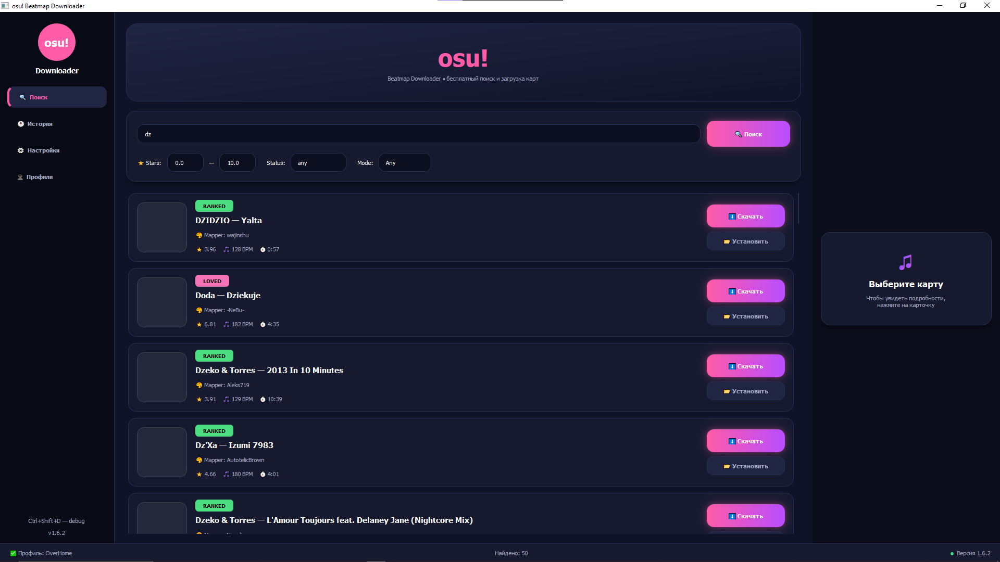
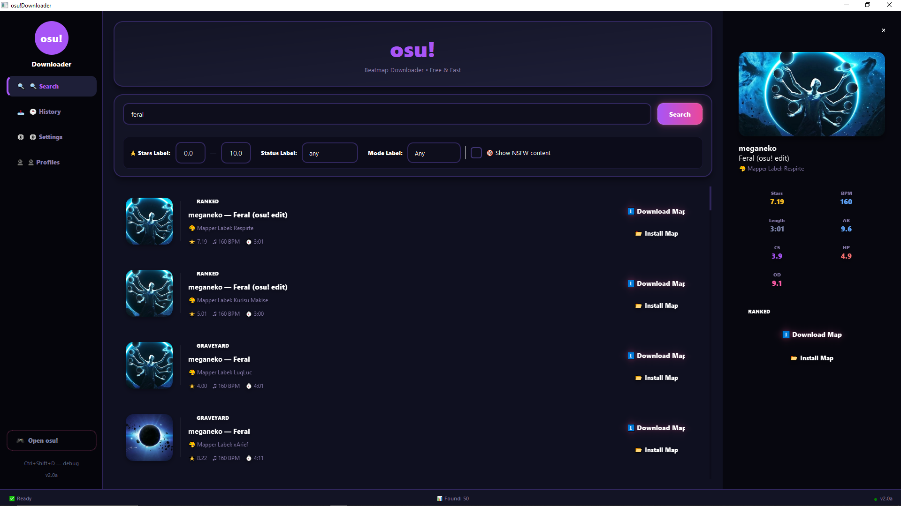

# osudownloader

Disclaimer

This project is an unofficial third-party application and is not affiliated with, endorsed by, or supported by osu!.
osu! and all related names, assets, and trademarks belong to their respective owners.
This project uses the official osu! API for search and metadata, but beatmap downloads may use third-party mirror services.
Availability, legality, and terms of such services may vary depending on region and jurisdiction.
Users are solely responsible for how they use this software.

	osu!Downloader
🌸 The most beautiful way to download osu! beatmaps

    🔍 Search any beatmap → ⬇️ Download in one click → 📂 Auto-install to osu!

 

🌟 Why This Downloader?
<table> <tr> <td width="50%">
🚀 Lightning Fast

Search across millions of beatmaps with instant results. Async architecture means the UI never freezes — even during heavy downloads.
🎨 Gorgeous Dark Themes

5 hand-crafted themes with card-based design, glowing accents, smooth hover effects, and pixel-perfect borders. Every pixel matters.
🔗 Multiple Mirrors

BeatConnect • Catboy • Sayobot • Chimu — if one mirror is down, switch instantly. Maximum speed, zero downtime.
</td> <td width="50%">
👤 Player Profiles

Full stat cards with PP, rank history charts, grade breakdowns, best plays, and most played maps — all beautifully rendered.
📂 One-Click Install

Download + auto-install maps directly into your osu! Songs folder. Or launch osu! right from the sidebar. Zero friction.
🌍 Multi-Language

English & Russian out of the box. Easily extensible — add your language in minutes.
</td> </tr> </table>

🎨 Themes:

🌸 Default	🌊 Ocean	🌲 Forest	🌅 Sunset	🌙 Midnight
 
 

⚡ Feature Highlights
 
🔍  Smart Search         Filter by stars, mode, status, NSFW
⬇️  Fast Downloads       Multiple mirror support for max speed
📂  Auto-Install         Maps go straight to your Songs folder
👤  Player Profiles      PP, ranks, grades, charts, best plays
🎮  osu! Launcher        Launch osu! directly from the app
🎨  5 Dark Themes        Gorgeous card-based modern UI
🌍  Multi-Language       English, Russian + extensible
💬  Discord RPC          Show activity in your Discord status
📊  Download History     Track everything with progress bars
🔧  Debug Console        Built-in dev tools (Ctrl+Shift+D)
🖼️  Image Caching        Instant loading on repeat views
📐  Responsive Layout    Adapts to any window size

